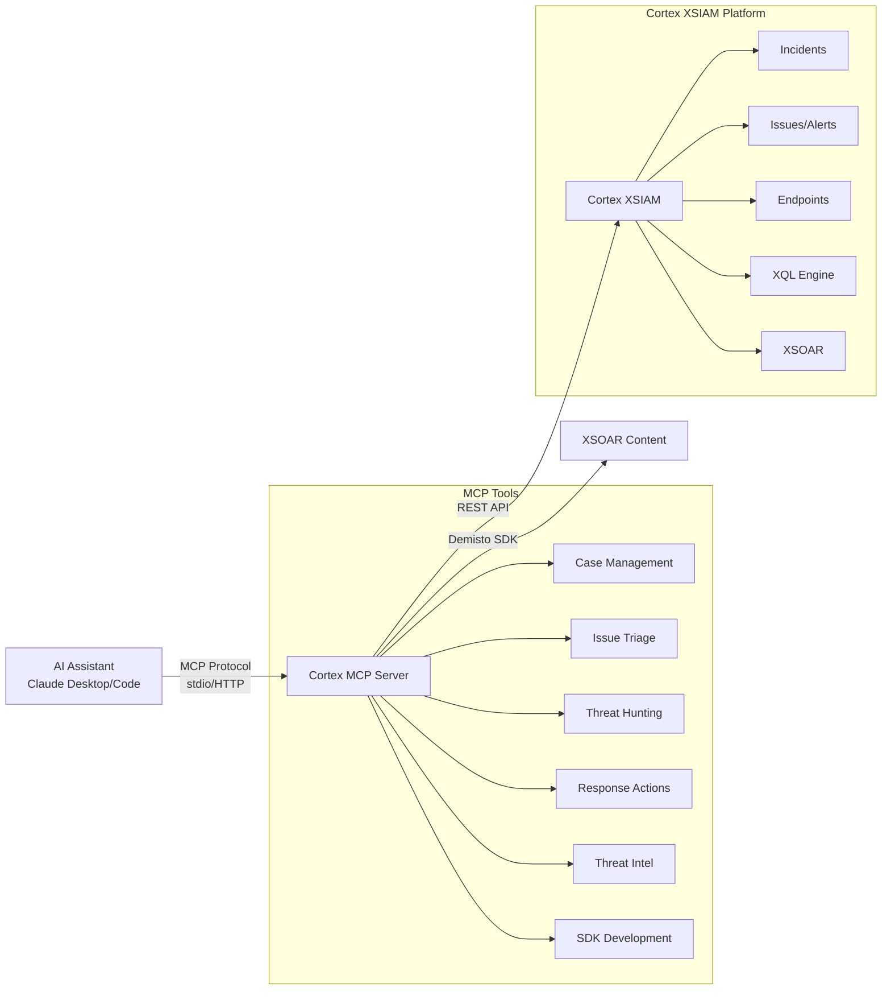

# Cortex XSIAM MCP Server

[](https://github.com/PaloAltoNetworks/cortex-mcp/actions/workflows/ci.yml)
[](LICENSE)
[](https://www.python.org/downloads/)

A Model Context Protocol (MCP) server that provides AI assistants with comprehensive security operations capabilities for [Cortex XSIAM](https://www.paloaltonetworks.com/cortex/cortex-xsiam). This server enables natural language security investigations, threat hunting, and incident response through 83 specialized tools.

> **📖 Official Documentation:** For the base Cortex MCP server installation and setup, see the [Official Palo Alto Networks Cortex MCP Server Documentation](https://docs-cortex.paloaltonetworks.com/r/Cortex-XSIAM/Cortex-XSIAM-Enterprise-Documentation/Cortex-MCP-server). This repository extends the official server with additional custom tools, XSOAR SDK integration, and development guides.

> **Important:** Install the **base Cortex MCP server first** following the [official PANW documentation](https://docs-cortex.paloaltonetworks.com/r/Cortex-XSIAM/Cortex-XSIAM-Enterprise-Documentation/Cortex-MCP-server), then follow the instructions below to add our custom components and enhancements.

> **Note:** This documentation is designed for both **humans** and **AI assistants**. AI agents can parse this README to understand installation steps, tool capabilities, and configuration requirements for automated setup and operation.

---

## Table of Contents

- [Features](#features)
- [Architecture](#architecture)
- [Installation Guide](#installation-guide)
- [Client Configuration](#client-configuration)
- [Available Tools](#available-tools)
- [XSOAR Development Tools](#xsoar-development-tools)
- [Safety Considerations](#safety-considerations)
- [Use Cases](#use-cases)
- [Adding Custom Tools](#adding-custom-tools)
- [Project Structure](#project-structure)
- [Development](#development)
- [Troubleshooting](#troubleshooting)
- [Contributing](#contributing)
- [License](#license)

---

## Features

- **Case Management** - List, investigate, and update security incidents
- **Issue Triage** - View and manage security issues (formerly called alerts) with full forensic context
- **Threat Hunting** - Execute XQL queries for proactive threat detection
- **Detection Rules** - Create and manage custom XQL-based correlation rules for automated threat detection
- **Response Actions** - Isolate endpoints, terminate processes, quarantine files
- **Threat Intelligence** - Enrich IOCs with reputation data from multiple sources
- **XSOAR Automation** - Execute any XSOAR command through the War Room
- **AI Summaries** - Generate comprehensive investigation reports automatically
- **XSOAR Development** - Create, validate, and deploy custom integrations and scripts via Demisto SDK
- **XSIAM Content Generation** - Programmatically create CaseLayouts, CaseFields, ParsingRules, ModelingRules, and more

---

## Architecture



**How it works:**
1. You interact with Claude (Desktop or Code) using natural language
2. Claude uses the MCP protocol to call specialized security tools
3. The MCP server translates requests to Cortex XSIAM API calls
4. Results are returned and Claude provides analysis and recommendations

---

## Installation Guide

> **AI INSTALLATION INSTRUCTIONS**: Follow these steps exactly in order. Each step must complete successfully before proceeding to the next.

### Step 1: Prerequisites

Before installation, ensure you have:

| Requirement | Version | How to Check | Install Command |
|-------------|---------|--------------|-----------------|
| Python | 3.12+ | `python --version` | [python.org/downloads](https://www.python.org/downloads/) |
| Git | Any | `git --version` | [git-scm.com](https://git-scm.com/) |
| Cortex XSIAM API Key | N/A | See below | [XSIAM API Guide](https://docs-cortex.paloaltonetworks.com/r/Cortex-XSIAM/Cortex-XSIAM-Administrator-Guide/Get-Started-with-APIs) |

**API Key Requirements:**
- Security Level: `Standard`
- Role: `Instance Administrator` (for full functionality)
- Required Permissions: Read access to incidents, alerts, endpoints; Write access for response actions

### Step 2: Clone Repository

```bash
git clone https://github.com/PaloAltoNetworks/cortex-mcp.git
cd cortex-mcp
```

**Expected result:** Directory `cortex-mcp` created with source files.

### Step 3: Create Virtual Environment

```bash
python -m venv venv
```

**Activate the virtual environment:**

| Platform | Command |
|----------|---------|
| macOS/Linux | `source venv/bin/activate` |
| Windows CMD | `venv\Scripts\activate.bat` |
| Windows PowerShell | `venv\Scripts\Activate.ps1` |

**Expected result:** Terminal prompt shows `(venv)` prefix.

### Step 4: Install Dependencies

```bash
pip install poetry
poetry install
```

**Expected result:** All dependencies installed without errors.

> ⚠️ **IMPORTANT:** Do NOT install `demisto-sdk` in this virtual environment! It requires pydantic 1.x which conflicts with the MCP server's pydantic 2.x requirement. See [XSOAR Development Tools](#xsoar-development-tools) for the correct way to use demisto-sdk.

### Step 5: Configure Credentials (Claude Code Centralized Method)

**Recommended**: Use Claude Code's centralized credential management (team-safe, secure)

**Create `.claude/settings.local.json`** (personal, git-ignored):

```json
{
  "env": {
    "DEMISTO_BASE_URL": "https://api-{tenant}.xdr.{region}.paloaltonetworks.com",
    "DEMISTO_API_KEY": "your_secret_api_key_here",
    "XSIAM_AUTH_ID": "your_api_key_id_here"
  }
}
```

**Why This Approach:**
- ✅ Secrets in `.claude/settings.local.json` (git-ignored, secure)
- ✅ Team config in `.claude/settings.json` (committed, no secrets)
- ✅ Works with demisto-sdk automatically (same variable names)
- ✅ MCP server maps these to internal variables
- ✅ Best practice for Claude Code projects

**Alternative**: Use `.env` file (legacy method)

```bash
cp .env.example .env
# Edit .env with CORTEX_MCP_PAPI_* variables
```

**Note**: MCP server automatically maps credentials:
- `DEMISTO_BASE_URL` → `CORTEX_MCP_PAPI_URL` (for MCP compatibility)
- `DEMISTO_API_KEY` → `CORTEX_MCP_PAPI_AUTH_HEADER`
- `XSIAM_AUTH_ID` → `CORTEX_MCP_PAPI_AUTH_ID`

**Variable Mapping Reference:**

| You Set (Standard SDK Names) | MCP Uses Internally | Description |
|------------------------------|---------------------|-------------|
| `DEMISTO_BASE_URL` | `CORTEX_MCP_PAPI_URL` | XSIAM API endpoint URL |
| `DEMISTO_API_KEY` | `CORTEX_MCP_PAPI_AUTH_HEADER` | API key value |
| `XSIAM_AUTH_ID` | `CORTEX_MCP_PAPI_AUTH_ID` | API key ID |

**Example Value:**
```
DEMISTO_BASE_URL=https://api-acme.xdr.us.paloaltonetworks.com
DEMISTO_API_KEY=xxxxxxxxxxxxxxxxxxx
XSIAM_AUTH_ID=12
```

**Available Regions:**
| Region Code | Location |
|-------------|----------|
| `us` | United States |
| `eu` | Europe |
| `uk` | United Kingdom |
| `sg` | Singapore |
| `jp` | Japan |
| `au` | Australia |
| `ca` | Canada |
| `in` | India |
| `de` | Germany |

### Step 6: Verify Installation

```bash
python src/main.py
```

**Expected result:** Server starts without errors. For stdio transport, no output means success.

### Step 7: Configure Your MCP Client

See [Client Configuration](#client-configuration) section below for Claude Desktop, Claude Code CLI, or Docker setup.

---

## Client Configuration

### Option A: Claude Desktop

**Configuration file location:**
| Platform | Path |
|----------|------|
| macOS | `~/Library/Application Support/Claude/claude_desktop_config.json` |
| Windows | `%APPDATA%\Claude\claude_desktop_config.json` |

**Add this configuration:**

```json
{
  "mcpServers": {
    "cortex-xsiam": {
      "command": "python",
      "args": ["/absolute/path/to/cortex-mcp/src/main.py"],
      "env": {
        "CORTEX_MCP_PAPI_URL": "https://api-{tenant}.xdr.{region}.paloaltonetworks.com",
        "CORTEX_MCP_PAPI_AUTH_HEADER": "your_api_key",
        "CORTEX_MCP_PAPI_AUTH_ID": "your_api_key_id"
      }
    }
  }
}
```

> **IMPORTANT:** Replace `/absolute/path/to/cortex-mcp` with the actual full path to your installation.

**Restart Claude Desktop after saving the configuration.**

### Option B: Claude Code CLI

Run this single command (replace placeholders with your values):

```bash
claude mcp add cortex-xsiam \
  -e CORTEX_MCP_PAPI_URL=https://api-{tenant}.xdr.{region}.paloaltonetworks.com \
  -e CORTEX_MCP_PAPI_AUTH_HEADER=your_api_key \
  -e CORTEX_MCP_PAPI_AUTH_ID=your_api_key_id \
  -- python /absolute/path/to/cortex-mcp/src/main.py
```

**Verify installation:**

```bash
claude mcp list
```

**Expected result:** `cortex-xsiam` appears in the list of configured servers.

### Option C: Docker

```bash
# Build the image
docker build -t cortex-mcp .

# Run with environment file
docker run --env-file .env -it cortex-mcp
```

---

## Available Tools

### Case Management (5 tools)

| Tool | Description | Key Parameters |
|------|-------------|----------------|
| `get_cases` | List and filter security cases | `filters`, `search_from`, `search_to` |
| `get_incident_extra_data` | Get full forensic case details | `incident_id`, `alerts_limit` |
| `update_incident` | Update case status, assignment, severity | `incident_id`, `status`, `assigned_user_mail` |
| `update_case_ai_summary` | Generate AI investigation summary | `case_id` |
| `update_case_timeline` | Generate visual HTML timeline | `case_id` |

#### AI Summary & Timeline Tools - Detailed Guide

**Custom Fields Used:**

These tools update XSIAM case custom fields that must be configured in your XSIAM instance:

| Field Name | Format | Purpose | Updated By |
|------------|--------|---------|------------|
| `aisummary` | **Markdown** | AI-generated investigation report | `update_case_ai_summary` |
| `timeline` | **HTML** | Visual chronological timeline | `update_case_timeline` |

**Note:** These are custom fields in XSIAM. To verify they exist:
```bash
# Get a case and check custom_fields
get_cases → check response → custom_fields.aisummary and custom_fields.timeline
```

**What `update_case_ai_summary` Generates:**

Creates a comprehensive Markdown investigation report including:
- Executive briefing with threat level and attack progression
- Attack narrative with timeline (first seen → most recent activity)
- Affected systems (hosts, users, alert counts by severity)
- MITRE ATT&CK tactics and techniques mapping
- Threat intelligence and risk assessment
- Impact assessment (technical and business)
- Immediate response actions (4 hours, 24-72 hours)
- Long-term remediation roadmap (weeks 1-4)
- Indicators of Compromise (file, process, network, behavioral)
- Success criteria checklist
- Stakeholder communication plan

**What `update_case_timeline` Generates:**

Creates a visual HTML timeline showing:
- All alerts in chronological order
- Severity-based color coding (critical=dark red, high=red, medium=orange, low=blue)
- Alert statistics summary (counts by severity, hosts, users)
- MITRE ATT&CK technique per alert
- Alert details (host, user, category, description)
- Interactive visual design optimized for XSIAM UI

**Prerequisites:**

- Case must exist with at least 1 alert
- Case must have basic metadata (hosts, users, severity)
- For AI summary: More alerts = better analysis (works best with 2+ alerts)
- For timeline: Works with any number of alerts

**Example Usage:**

```python
# Generate AI investigation summary
update_case_ai_summary(case_id="350")
# → Updates custom_fields.aisummary with comprehensive Markdown report

# Generate visual timeline
update_case_timeline(case_id="350")
# → Updates custom_fields.timeline with HTML visualization

# View results - fetch the case
get_cases(filters=[{"field": "case_id", "operator": "in", "value": [350]}])
# → Check custom_fields.aisummary (Markdown) and custom_fields.timeline (HTML)
```

**Viewing in XSIAM UI:**

1. Navigate to case in XSIAM web interface
2. Custom fields appear in case details panel
3. `aisummary` renders as formatted Markdown
4. `timeline` renders as interactive HTML visualization

**Field Configuration:**

If these custom fields don't exist in your XSIAM instance, create them:

1. XSIAM UI → Settings → Objects → Incident Types
2. Add custom field: `aisummary` (type: Long Text, format: Markdown)
3. Add custom field: `timeline` (type: Long Text, format: HTML)

Or check if they're already configured (most XSIAM instances have them pre-configured).

### Issue Management (4 tools)

> **Terminology Note:** In XSIAM APIs, security alerts are called "issues". These tools manage individual security events.

| Tool | Description | Key Parameters |
|------|-------------|----------------|
| `get_issues` | List and filter security issues (formerly alerts) | `filters`, `search_from`, `search_to` |
| `get_alert_multi_events` | Get detailed issue/alert event data | `filters` (alert_id_list) |
| `get_contributing_events` | Get correlation issue events | `alert_id` |
| `update_issue` | Update issue severity/status | `issue_id`, `severity`, `status` |

### Response Actions (6 tools)

| Tool | Description | Risk Level | Reversal |
|------|-------------|------------|----------|
| `isolate_endpoint` | Isolate endpoint from network | HIGH | `unisolate_endpoint` |
| `unisolate_endpoint` | Restore endpoint connectivity | LOW | N/A |
| `scan_endpoint` | Initiate malware scan | LOW | `abort_scan` |
| `abort_scan` | Cancel running scan | LOW | N/A |
| `terminate_process` | Kill process by name | HIGH | None (permanent) |
| `terminate_causality` | Kill entire process tree | HIGH | None (permanent) |

### Threat Hunting & Intelligence (6 tools)

| Tool | Description | Key Parameters |
|------|-------------|----------------|
| `run_xql_query` | Execute XQL queries | `query`, `time_frame` |
| `enrich_ip_address` | IP reputation lookup | `ip_address`, `alert_id` |
| `enrich_domain` | Domain reputation lookup | `domain`, `alert_id` |
| `enrich_file_hash` | File hash reputation | `file_hash`, `alert_id` |
| `enrich_url` | URL reputation lookup | `url`, `alert_id` |
| `run_xsoar_automation` | Execute XSOAR commands | `command`, `alert_id` |

### Detection & Rules (1 tool)

| Tool | Description | Key Parameters |
|------|-------------|----------------|
| `insert_correlation_rule` | Create/update XQL-based detection rules | `rule_id`, `name`, `xql_query`, `severity`, `alert_category` |

**Correlation Rules** are XQL-based detection rules that continuously analyze incoming data and generate alerts when suspicious patterns are detected. Use this tool to:
- Create custom threat detection logic
- Implement organization-specific security policies
- Deploy detection rules based on threat intelligence
- Monitor for specific attack patterns and IOCs

**Example - Create SSH Brute Force Detection:**
```python
insert_correlation_rule(
    rule_id=10001,
    name="SSH Brute Force Detection",
    xql_query="dataset = xdr_data | filter event_type = ENUM.AUTHENTICATION and action_service_name = 'SSH' and outcome = ENUM.FAILED | comp count() by source_ip, user | filter count > 5",
    severity="SEV_040_HIGH",
    alert_name="SSH Brute Force Attempt Detected",
    alert_category="CREDENTIAL_ACCESS",
    is_enabled=True,
    description="Detects multiple failed SSH authentication attempts indicating brute force attack",
    search_window="5 minutes"
)
```

**Severity Levels:** `SEV_010_INFORMATIONAL`, `SEV_020_LOW`, `SEV_030_MEDIUM`, `SEV_040_HIGH`, `SEV_050_CRITICAL`

**Alert Categories (MITRE ATT&CK):** `RECONNAISSANCE`, `INITIAL_ACCESS`, `EXECUTION`, `PERSISTENCE`, `PRIVILEGE_ESCALATION`, `DEFENSE_EVASION`, `CREDENTIAL_ACCESS`, `DISCOVERY`, `LATERAL_MOVEMENT`, `COLLECTION`, `COMMAND_AND_CONTROL`, `EXFILTRATION`, `IMPACT`

### Additional Tools

| Category | Tools |
|----------|-------|
| File Operations | `quarantine_files`, `restore_file`, `retrieve_files`, `get_file_retrieval_details`, `get_quarantine_status` |
| Script Execution | `run_script`, `run_snippet_code_script`, `get_scripts`, `get_script_metadata`, `get_script_execution_status`, `get_script_execution_results` |
| IOC Management | `insert_indicators_json`, `insert_indicators_csv` |
| War Room | `add_war_room_entry`, `get_war_room_entries` |
| Assets & Risk | `get_assets`, `get_endpoints`, `list_risky_users`, `list_risky_hosts`, `get_assessment_profile_results` |
| Action Tracking | `get_action_status` |

---

## XSOAR Development Tools

Build, test, and deploy custom XSOAR integrations and scripts directly from your AI assistant.

### Prerequisites & Python Version Compatibility

**IMPORTANT:** The MCP server and Demisto SDK have **incompatible Python dependency requirements**:

| Component | Python Version | Pydantic Version | Reason |
|-----------|---------------|------------------|--------|
| **MCP Server** | 3.12+ | 2.11.0+ | Required by FastMCP and MCP libraries |
| **Demisto SDK** | 3.9-3.11 | 1.10.x | Legacy requirement, not compatible with Pydantic 2.x |

### Solution: Use `uvx` to Run Demisto SDK

The SDK tools in this MCP server use `uvx` (from the `uv` package manager) to run `demisto-sdk` in an isolated environment. This automatically handles the version conflict.

**For Humans (Manual SDK Usage):**

If you need to run `demisto-sdk` commands manually outside the MCP server:

```bash
# Option 1: Use uvx (recommended - handles dependencies automatically)
uvx demisto-sdk upload -i Packs/MyPack

# Option 2: Create a separate virtual environment
python3.10 -m venv demisto-sdk-venv
source demisto-sdk-venv/bin/activate
pip install demisto-sdk
demisto-sdk upload -i Packs/MyPack
deactivate
```

**For AI Assistants:**

When using the MCP SDK tools (`sdk_upload`, `sdk_validate`, etc.), the Python version conflict is handled automatically via `uvx`. The tools will:

1. Run `demisto-sdk` in an isolated environment with the correct dependencies
2. Pass through all required environment variables (API keys, URLs)
3. Return results to the main MCP process

No special configuration needed - just call the SDK tools normally.

**Environment Variables Required:**

```bash
# Set these in your .env file or export them
export DEMISTO_BASE_URL=$CORTEX_MCP_PAPI_URL
export DEMISTO_API_KEY=$CORTEX_MCP_PAPI_AUTH_HEADER
export XSIAM_AUTH_ID=$CORTEX_MCP_PAPI_AUTH_ID
```

### Shared Content Repository

**Location**: `/Users/apekarovsky/projects/content/` (or `~/projects/content`)

This directory contains XSOAR content packs that can be:
- Shared across multiple AI agent sessions
- Collaboratively developed
- Version controlled separately
- Used by demisto-sdk tools

**Structure**:
```
~/projects/content/
├── Packs/
│   ├── NetworkTools/
│   │   ├── Scripts/SSHScan/
│   │   └── Playbooks/CloseNoisyIssues.yml
│   ├── PingTools/
│   └── ThreatHunting/
```

SDK tools automatically use this shared location when creating, validating, or uploading content.

### Development Guide Tools (9 tools)

> **For AI Assistants:** Call these tools BEFORE creating integrations or playbooks!
> **New:** create_playbook tool now available for programmatic playbook generation!

| Tool | When to Use | Returns |
|------|-------------|---------|
| `get_xsoar_pattern_guide` | **Call FIRST** before any integration | Pattern recognition guide (monitor→long-running, fetch→event collector) |
| `get_xsoar_long_running_guide` | User wants continuous monitoring/webhooks | Complete guide with while True pattern, no threading, examples |
| `get_xsoar_event_collector_guide` | User wants to fetch/pull/import data | Complete guide with fetch-incidents, send_events_to_xsiam |
| `get_xsoar_scheduled_commands_guide` | User needs polling/async operations | Polling pattern for sandbox analysis, long searches |
| `get_xsoar_mirroring_guide` | User needs bidirectional sync | ServiceNow, Jira incident mirroring |
| `get_xsoar_feed_guide` | User building threat intel feed | TAXII, STIX, custom IOC feeds |
| `get_xsoar_best_practices` | Need specific topic guidance | Best practices for threading, state management, errors |
| `get_playbook_building_blocks` | **Building playbooks** | 60+ sub-playbooks, 30+ scripts, 10+ transformers from production analysis |
| `create_playbook` | **Generate playbooks** | Creates valid XSOAR playbooks from simplified task definitions |

**How AI uses these:**
1. User: "Monitor Redis health"
2. AI calls `get_xsoar_pattern_guide()` → learns "monitor" = long-running
3. AI calls `get_xsoar_long_running_guide()` → gets complete implementation guide
4. AI implements correctly with while True in main thread, integration context, etc.

### SDK Build Tools (10 tools)

| Tool | Description | Example Usage |
|------|-------------|---------------|
| `sdk_init` | Create new integration/script scaffold | `sdk_init(name="MyIntegration", content_type="integration")` |
| `sdk_validate` | Validate content structure and code | `sdk_validate(path="Packs/MyPack")` |
| `sdk_lint` | Lint Python code for best practices | `sdk_lint(path="Packs/MyPack", fix=True)` |
| `sdk_upload` | Upload integration/script to XSIAM | `sdk_upload(path="Packs/MyPack")` |
| `sdk_download` | Download content from XSIAM | `sdk_download(content_name="MyIntegration")` |
| `sdk_run` | Execute integration commands | `sdk_run(command="ip ip=8.8.8.8")` |
| `sdk_run_playbook` | Test playbook execution | `sdk_run_playbook(playbook_name="MyPlaybook")` |
| `sdk_generate_docs` | Generate documentation | `sdk_generate_docs(path="Packs/MyPack")` |
| `sdk_split` | Split unified YAML to directory | `sdk_split(path="integration.yml")` |
| `sdk_unify` | Create unified YAML from directory | `sdk_unify(path="Packs/MyPack/Integrations/MyInt")` |

### Example Workflow with Guide Tools

```
You: "Create a Redis monitoring integration"

Claude:
  1. Calls get_xsoar_pattern_guide() - learns "monitor" = long-running
  2. Calls get_xsoar_long_running_guide() - gets architecture patterns
  3. Creates scaffold with sdk_init
  4. Writes Python code following guide (while True, integration context, etc.)
  5. Validates with sdk_validate
  6. Uploads to XSIAM with sdk_upload
  7. Tests with run_xsoar_automation
  8. Fixes any issues and redeploys
```

---

## Safety Considerations

### Destructive Commands

> **WARNING:** The following tools perform actions that may be difficult or impossible to reverse.

| Tool | Risk Level | Reversible | Reversal Tool | Confirmation Required |
|------|------------|------------|---------------|----------------------|
| `isolate_endpoint` | HIGH | Yes | `unisolate_endpoint` | Yes |
| `terminate_process` | HIGH | No | N/A - processes terminated permanently | Yes |
| `terminate_causality` | HIGH | No | N/A - process trees terminated permanently | Yes |
| `quarantine_files` | HIGH | Yes | `restore_file` | Yes |
| `run_script` | HIGH | Depends on script | N/A | Yes |
| `run_snippet_code_script` | HIGH | Depends on code | N/A | Yes |

### Enabling Destructive Tools

By default, high-risk tools are disabled. To enable:

```ini
# In .env file
ENABLE_DESTRUCTIVE_TOOLS=true
```

### Large Output Tools

| Tool | Potential Size | Mitigation |
|------|---------------|------------|
| `get_alert_multi_events` | Very Large | Filter by specific alert IDs |
| `get_incident_extra_data` | Large | Use `alerts_limit` parameter |
| `run_xql_query` | Variable | Always use `LIMIT` clause |
| `get_issues` | Large | Use pagination (`search_from`/`search_to`) |
| `get_cases` | Medium | Limited to 10 results per request |

---

## Use Cases

For detailed walkthroughs with full code examples, see **[USECASES.md](USECASES.md)**.

### Quick Examples

| Prompt | What Happens |
|--------|--------------|
| *"Show me all high severity cases from the last 24 hours"* | Lists cases, shows alert counts, affected hosts |
| *"Investigate case 350 and generate an AI summary"* | Gets full case details, analyzes alerts, generates report |
| *"Hunt for PowerShell execution on domain controllers"* | Runs XQL query, shows process trees, identifies anomalies |
| *"Isolate endpoint Server-DC-1 immediately"* | Confirms action, isolates endpoint, monitors status |
| *"Enrich this IP: 45.33.32.156"* | Checks VirusTotal, shows reputation, related malware |
| *"Create a custom integration for our ticketing system"* | Scaffolds code, writes Python, uploads to XSIAM |

### Featured Use Cases

1. **Multi-Stage Attack Investigation** - Follow an attack chain from initial access to lateral movement
2. **Ransomware Containment** - Isolate, terminate, quarantine in coordinated response
3. **Custom Integration Development** - Build XSOAR integrations with AI assistance
4. **Automated Phishing Analysis** - Extract IOCs, enrich, block threats automatically

---

## Adding Custom Tools

### Python Tools

Create a new file in `src/usecase/custom_components/`:

```python
from fastmcp import Context
from usecase.base_module import BaseModule

async def my_custom_tool(ctx: Context, param: str) -> str:
    """Tool description for the AI."""
    # Your implementation
    return '{"result": "success"}'

class MyModule(BaseModule):
    def register_tools(self):
        self._add_tool(my_custom_tool)

    def register_resources(self):
        pass
```

### OpenAPI Tools

Create a YAML file in `src/usecase/custom_components/openapi/`:

```yaml
openapi: 3.0.0
info:
  title: My Custom Tool
  version: 1.0.0
paths:
  /public_api/v1/your/endpoint:
    post:
      operationId: my_tool
      summary: Short description
      description: |
        Detailed description for AI assistants.

        Use this tool when:
        - Condition 1
        - Condition 2
      requestBody:
        required: true
        content:
          application/json:
            schema:
              type: object
              properties:
                param1:
                  type: string
                  description: Parameter description
              required:
                - param1
      responses:
        '200':
          description: Success response
```

---

## Project Structure

```
cortex-mcp/
├── src/
│   ├── main.py                    # Server entry point
│   ├── config/                    # Configuration management
│   ├── entities/                  # Data models
│   ├── pkg/                       # Core utilities
│   ├── service/                   # MCP server implementation
│   └── usecase/
│       ├── builtin_components/    # Core MCP tools
│       ├── custom_components/     # Extended tools (40+)
│       │   ├── openapi/          # OpenAPI-defined tools
│       │   ├── sdk_base.py       # SDK runner base class
│       │   └── sdk_tools.py      # SDK wrapper tools
│       └── remote_components/     # Remote tool imports
├── tests/                         # Test suite
├── docs/                          # Documentation
├── .env.example                   # Environment template
├── pyproject.toml                 # Poetry dependencies
└── Dockerfile                     # Container support
```

---

## Development

```bash
# Run tests
poetry run pytest

# Format code
poetry run black .
poetry run ruff check --fix .

# Type checking
poetry run mypy src/
```

---

## Troubleshooting

### Common Errors and Solutions

| Error Message | Cause | Solution |
|---------------|-------|----------|
| `401 Unauthorized` | Invalid API key | Verify `CORTEX_MCP_PAPI_AUTH_HEADER` and `CORTEX_MCP_PAPI_AUTH_ID` values |
| `403 Forbidden` | Insufficient permissions | Ensure API key has Instance Administrator role |
| `Connection refused` | Wrong URL format | Check URL matches `https://api-{tenant}.xdr.{region}.paloaltonetworks.com` |
| `pyenv: version '3.12' is not installed` | `.python-version` file constraint | Remove `.python-version` file: `rm .python-version` then recreate venv |
| `Could not find investigations` | Issue not in a case | War Room tools require issues (formerly alerts) that are part of a case. Use `get_issues` to find an issue, then check if it has a `case_id` field. |
| `ImportError: cannot import name 'ModelMetaclass' from 'pydantic.main'` | Pydantic version conflict | MCP server needs pydantic 2.x, demisto-sdk needs 1.x. Use `uvx demisto-sdk` instead of installing directly. See [XSOAR Development Tools](#xsoar-development-tools) |
| `demisto-sdk not found` | SDK not in PATH | The MCP SDK tools use `uvx demisto-sdk` automatically. For manual use: `uvx demisto-sdk <command>` |
| `DEMISTO_BASE_URL value is not set` | Missing env vars | Export: `DEMISTO_BASE_URL`, `DEMISTO_API_KEY`, `XSIAM_AUTH_ID` (see [XSOAR Development Tools](#xsoar-development-tools)) |

### Pydantic Version Conflict Resolution

**Problem:** `pip install demisto-sdk` in the MCP venv causes pydantic conflicts.

**Why:** MCP server requires pydantic 2.x, but demisto-sdk requires pydantic 1.x. They cannot coexist.

**Solution:**
```bash
# ✅ DO THIS - Use uvx to run demisto-sdk in isolation
uvx demisto-sdk upload -i Packs/MyPack

# ❌ DON'T DO THIS - Installing in MCP venv breaks the server
pip install demisto-sdk  # Will break MCP server!
```

**For AI Assistants:** The MCP SDK tools (`sdk_upload`, `sdk_validate`, etc.) handle this automatically using `uvx`.

### Debug Logging

```bash
LOG_LEVEL=DEBUG python src/main.py
```

### Verification Commands

```bash
# Check Python version
python --version

# Check if server starts
python src/main.py

# Check MCP client configuration (Claude Code)
claude mcp list

# Test API connectivity
curl -X POST "https://api-{tenant}.xdr.{region}.paloaltonetworks.com/public_api/v1/incidents/get_incidents" \
  -H "Authorization: {your_api_key}" \
  -H "x-xdr-auth-id: {your_api_key_id}" \
  -H "Content-Type: application/json" \
  -d '{"request_data": {}}'
```

---

## Contributing

We welcome contributions! Please see our [Contributing Guide](CONTRIBUTING.md) for details.

## Security

For security concerns, please see our [Security Policy](SECURITY.md). Do not report security vulnerabilities through public GitHub issues.

## License

This project is licensed under the Apache License 2.0 - see the [LICENSE](LICENSE) file for details.

## Support

- **Documentation**: [docs/](docs/)
- **Issues**: [GitHub Issues](https://github.com/PaloAltoNetworks/cortex-mcp/issues)
- **Cortex XSIAM Docs**: [docs-cortex.paloaltonetworks.com](https://docs-cortex.paloaltonetworks.com)

---

Made with :purple_heart: by Palo Alto Networks
