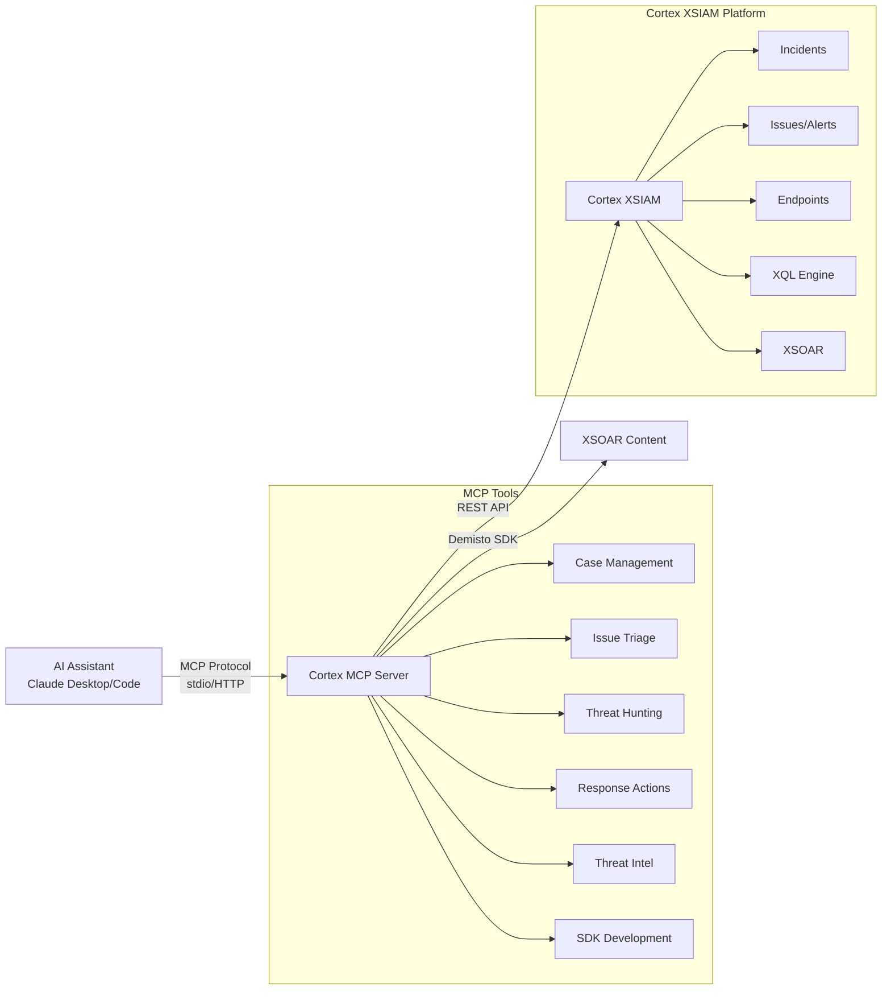

# Cortex Bot - AI-Powered Security Operations Foundation

[](https://github.com/PaloAltoNetworks/cortex-mcp/actions/workflows/ci.yml)
[](LICENSE)
[](https://www.python.org/downloads/)

The foundation for **Cortex Bot**, an AI-powered security operations assistant for [Cortex XSIAM](https://www.paloaltonetworks.com/cortex/cortex-xsiam). Built on the official Palo Alto Networks Cortex MCP Server, this repository adds 84 specialized tools, smart automation capabilities, and infrastructure for skills and sub-agents.

> **⚠️ PREREQUISITES:** Install the [official Cortex MCP Server](https://docs-cortex.paloaltonetworks.com/r/Cortex/Cortex-MCP-server/Create-custom-Cortex-MCP-server-tools) FIRST, then add Cortex Bot components from this repository.

**Total Capabilities:** 90 tools (6 official base + 84 Cortex Bot custom) | Smart Tools | Skills (Coming Soon) | Sub-Agents (Coming Soon)

---

## Table of Contents

- [Features](#features)
- [Quick Start](#quick-start)
- [Architecture](#architecture)
- [Installation Guide](#installation-guide)
- [Client Configuration](#client-configuration)
- [Available Tools](#available-tools)
- [XSOAR Development Tools](#xsoar-development-tools)
- [Testing Your Installation](#testing-your-installation)
- [Safety Considerations](#safety-considerations)
- [Use Cases](#use-cases)
- [Example Commands with Output](#example-commands-with-output)
- [What Can You Ask Claude?](#what-can-you-ask-claude)
- [FAQ](#faq)
- [Adding Custom Tools](#adding-custom-tools)
- [Project Structure](#project-structure)
- [Development](#development)
- [Troubleshooting](#troubleshooting)
- [Contributing](#contributing)
- [License](#license)

---

## Features

### Official PANW MCP Server (Base - 6 Tools)
- Case Management - List and filter cases
- Issue Management - View and query issues
- Asset Discovery - List endpoints and assets
- Assessment Results - Compliance posture data

### Cortex Bot Enhancements (+84 Tools)

**Advanced Investigation:**
- **AI-Powered Summaries** - Auto-generate comprehensive investigation reports
- **Visual Timelines** - Create interactive HTML timelines for cases
- **Deep Forensics** - get_alert_multi_events with complete event chains
- **Contributing Events** - Correlation alert analysis

**Threat Hunting & Detection:**
- **XQL Query Execution** - run_xql_query with full syntax support
- **Detection Rules** - Create/manage custom XQL-based correlation rules
- **Threat Intelligence** - Multi-source IOC enrichment (IP, domain, file, URL)

**Response & Containment:**
- **Endpoint Actions** - Isolate, scan, retrieve files
- **Process Control** - Terminate processes and causality chains
- **File Operations** - Quarantine, restore, check status
- **Indicator Blocking** - IOC management and blocklisting

**XSOAR Development (10 SDK Tools):**
- Create, validate, lint, upload integrations and scripts
- Full demisto-sdk integration via MCP
- Development guides for all integration patterns

**Playbook Automation (3 Tools):**
- **create_playbook** - Programmatic playbook generation with auto-formatting
- **insert_playbook** - Direct API upload
- **delete_playbook** - Playbook lifecycle management

**Content Generation (11 Tools):**
- CaseLayouts, CaseFields, LayoutRules
- XSIAMDashboards, XSIAMReports with XQL widgets
- ParsingRules, ModelingRules, AssetsModelingRules
- AgentIX Actions and Agents

**Development Guides (9 Tools):**
- Pattern recognition, integration types, best practices
- Comprehensive implementation guides

**Testing & Validation:**
- **test_all_tools** - Automated testing for all 90 tools
- Category-specific test suites

---

## Quick Start

**Prerequisites:** Python 3.12+, Cortex XSIAM API key, Claude Desktop or Claude Code

### Step 1: Install Official Cortex MCP Server (Required)

Follow the [official PANW installation guide](https://docs-cortex.paloaltonetworks.com/r/Cortex/Cortex-MCP-server/Create-custom-Cortex-MCP-server-tools):

1. Open your Cortex XSIAM tenant
2. Navigate to Settings → Integrations → Cortex MCP Server
3. Download the MCP server package
4. Extract and install via Docker or Poetry (Python 3.13+)
5. Configure your MCP client (Claude Desktop/Code)
6. **Verify:** You should see 6 base tools available (get_cases, get_issues, get_assets, etc.)

### Step 2: Add Cortex Bot Enhancements (This Repo)

```bash
# Clone Cortex Bot repository
git clone <GITHUB_REPO_URL>
cd cortex-bot-custom-tools

# Copy custom tools to your official PANW Cortex MCP installation
cp -r custom_components/* /path/to/official-cortex-mcp/src/usecase/custom_components/

# Restart your MCP server
pkill -f "cortex.*main.py"  # Server will auto-restart

# Verify: You should now see 90 total tools (6 base + 84 custom)
claude
# Test: "List all available MCP tools"
# Expected: You should see 90 cortex-xsiam tools

# Try it!
# Ask: "Create a phishing investigation playbook"
```

**Next steps:** See [Installation Guide](#installation-guide) for detailed configuration, multi-tenant setup, and troubleshooting.

---

## Architecture



The MCP server translates natural language requests into Cortex XSIAM REST API calls, enabling Claude to perform security operations through simple conversation.

---

## Installation Guide

This guide shows how to add Cortex Bot enhancements to your existing official Cortex MCP Server installation.

### Step 1: Prerequisites

**Required:**

| Requirement | Version | How to Check | Install Guide |
|-------------|---------|--------------|---------------|
| Official Cortex MCP Server | Latest | Check Claude Desktop/Code shows 6 base tools | [PANW Installation Guide](https://docs-cortex.paloaltonetworks.com/r/Cortex/Cortex-MCP-server/Create-custom-Cortex-MCP-server-tools) |
| Python | 3.12+ | `python --version` | [python.org/downloads](https://www.python.org/downloads/) |
| Git | Any | `git --version` | [git-scm.com](https://git-scm.com/) |
| Cortex XSIAM API Key | N/A | See below | [XSIAM API Guide](https://docs-cortex.paloaltonetworks.com/r/Cortex-XSIAM/Cortex-XSIAM-Administrator-Guide/Get-Started-with-APIs) |

**API Key Requirements:**
- Security Level: `Standard`
- Role: `Instance Administrator` (for full functionality)
- Required Permissions: Read access to incidents, alerts, endpoints; Write access for response actions

> **IMPORTANT:** You MUST install the official Cortex MCP Server first before adding these enhancements. Cortex Bot extends the official server with additional tools.

### Step 2: Clone Cortex Bot Repository

```bash
git clone https://github.com/YourOrg/cortex-bot-custom-tools.git
cd cortex-bot-custom-tools
```

### Step 3: Copy Custom Tools to Official MCP Installation

```bash
# Find your official PANW Cortex MCP installation directory
# Common locations:
# - Docker: /opt/cortex-mcp
# - Poetry: ~/.local/share/cortex-mcp or ~/cortex-mcp
# - Manual: wherever you installed it

# Copy the custom_components folder
cp -r custom_components/* /path/to/official-cortex-mcp/src/usecase/custom_components/

# Example for typical installation:
# cp -r custom_components/* ~/cortex-mcp/src/usecase/custom_components/
```

**That's it!** No dependencies to install - these are pure Python tools that use the official server's environment.

### Step 4: Restart MCP Server

```bash
# For Docker installations
docker restart cortex-mcp

# For Poetry/manual installations
pkill -f "cortex-mcp.*main.py"
# Then restart via your MCP client (Claude Desktop/Code)
```

### Step 5: Verify Installation

Open Claude Desktop or Claude Code and verify:

```bash
/mcp
```

**Expected output:** `Connected to cortex-xsiam (90 tools)`

If you see 90 tools, installation is complete! The 6 official tools + 84 Cortex Bot custom tools are now available.

**For advanced configuration** (multi-tenant setups, credential priority, troubleshooting): See [docs/CREDENTIAL_CONFIGURATION.md](docs/CREDENTIAL_CONFIGURATION.md)

---

## Client Configuration

### Option A: Claude Desktop

**Configuration file location:**
| Platform | Path |
|----------|------|
| macOS | `~/Library/Application Support/Claude/claude_desktop_config.json` |
| Windows | `%APPDATA%\Claude\claude_desktop_config.json` |

**Recommended Configuration:**

```json
{
  "mcpServers": {
    "cortex-xsiam": {
      "command": "python",
      "args": ["/absolute/path/to/cortex-mcp/src/main.py"]
    }
  }
}
```

> **IMPORTANT:**
> - Replace `/absolute/path/to/cortex-mcp` with the actual full path
> - Credentials are loaded from `cortex-mcp/.env` automatically
> - **DO NOT** add credentials to this JSON file for security reasons
> - Restart Claude Desktop after saving

**To use a different tenant:** Export environment variables before starting Claude Desktop:
```bash
export CORTEX_MCP_PAPI_URL=https://api-dev.xdr.eu.paloaltonetworks.com
export CORTEX_MCP_PAPI_AUTH_HEADER=dev_api_key
export CORTEX_MCP_PAPI_AUTH_ID=27
open -a "Claude"
```

### Option B: Claude Code CLI

**Recommended Configuration:**

```bash
# From your project directory
claude mcp add cortex-xsiam -- python /absolute/path/to/cortex-mcp/src/main.py
```

**Credentials** are loaded from `cortex-mcp/.env` automatically.

**For different tenant:** Export environment variables before starting Claude Code:
```bash
export CORTEX_MCP_PAPI_URL=https://api-dev.xdr.eu.paloaltonetworks.com
export CORTEX_MCP_PAPI_AUTH_HEADER=dev_api_key
export CORTEX_MCP_PAPI_AUTH_ID=27
cd ~/projects/my-project
claude
```

**Verify installation:**
```bash
claude mcp list
```

**Expected result:** `cortex-xsiam` appears in the list of configured servers.

### Option C: Gemini (Google AI Studio with MCP)

Create `settings.local.json` in your project directory:

```json
{
  "mcpServers": {
    "cortex-xsiam": {
      "command": "python",
      "args": ["/absolute/path/to/cortex-mcp/src/main.py"]
    }
  }
}
```

**Credentials** are loaded from `cortex-mcp/.env` automatically.

### Option D: Docker

```bash
# Build the image
docker build -t cortex-mcp .

# Run with .env file (secure)
docker run --env-file /absolute/path/to/cortex-mcp/.env -it cortex-mcp
```

---

## Available Tools

### Case Management (5 tools)

| Tool | Description | Key Parameters |
|------|-------------|----------------|
| `get_cases` | List and filter security cases | `filters`, `search_from`, `search_to` |
| `get_incident_extra_data` | Get full forensic case details | `incident_id`, `alerts_limit` |
| `update_incident` | Update case status, assignment, severity | `incident_id`, `status`, `assigned_user_mail` |
| `update_case_ai_summary` | Generate AI investigation summary | `case_id` |
| `update_case_timeline` | Generate visual HTML timeline | `case_id` |

#### AI Summary & Timeline Tools - Detailed Guide

**Custom Fields Used:**

These tools update XSIAM case custom fields that must be configured in your XSIAM instance:

| Field Name | Format | Purpose | Updated By |
|------------|--------|---------|------------|
| `aisummary` | **Markdown** | AI-generated investigation report | `update_case_ai_summary` |
| `timeline` | **HTML** | Visual chronological timeline | `update_case_timeline` |

**Note:** These are custom fields in XSIAM. To verify they exist:
```bash
# Get a case and check custom_fields
get_cases → check response → custom_fields.aisummary and custom_fields.timeline
```

**What `update_case_ai_summary` Generates:**

Creates a comprehensive Markdown investigation report including:
- Executive briefing with threat level and attack progression
- Attack narrative with timeline (first seen → most recent activity)
- Affected systems (hosts, users, alert counts by severity)
- MITRE ATT&CK tactics and techniques mapping
- Threat intelligence and risk assessment
- Impact assessment (technical and business)
- Immediate response actions (4 hours, 24-72 hours)
- Long-term remediation roadmap (weeks 1-4)
- Indicators of Compromise (file, process, network, behavioral)
- Success criteria checklist
- Stakeholder communication plan

**What `update_case_timeline` Generates:**

Creates a visual HTML timeline showing:
- All alerts in chronological order
- Severity-based color coding (critical=dark red, high=red, medium=orange, low=blue)
- Alert statistics summary (counts by severity, hosts, users)
- MITRE ATT&CK technique per alert
- Alert details (host, user, category, description)
- Interactive visual design optimized for XSIAM UI

**Prerequisites:**

- Case must exist with at least 1 alert
- Case must have basic metadata (hosts, users, severity)
- For AI summary: More alerts = better analysis (works best with 2+ alerts)
- For timeline: Works with any number of alerts

**Example Usage:**

```python
# Generate AI investigation summary
update_case_ai_summary(case_id="350")
# → Updates custom_fields.aisummary with comprehensive Markdown report

# Generate visual timeline
update_case_timeline(case_id="350")
# → Updates custom_fields.timeline with HTML visualization

# View results - fetch the case
get_cases(filters=[{"field": "case_id", "operator": "in", "value": [350]}])
# → Check custom_fields.aisummary (Markdown) and custom_fields.timeline (HTML)
```

**Viewing in XSIAM UI:**

1. Navigate to case in XSIAM web interface
2. Custom fields appear in case details panel
3. `aisummary` renders as formatted Markdown
4. `timeline` renders as interactive HTML visualization

**Field Configuration:**

If these custom fields don't exist in your XSIAM instance, create them:

1. XSIAM UI → Settings → Objects → Incident Types
2. Add custom field: `aisummary` (type: Long Text, format: Markdown)
3. Add custom field: `timeline` (type: Long Text, format: HTML)

Or check if they're already configured (most XSIAM instances have them pre-configured).

### Issue Management (4 tools)

| Tool | Description | Key Parameters |
|------|-------------|----------------|
| `get_issues` | List and filter security issues | `filters`, `search_from`, `search_to` |
| `get_alert_multi_events` | Get detailed issue/alert event data | `filters` (alert_id_list) |
| `get_contributing_events` | Get correlation issue events | `alert_id` |
| `update_issue` | Update issue severity/status | `issue_id`, `severity`, `status` |

### Response Actions (6 tools)

| Tool | Description | Risk Level | Reversal |
|------|-------------|------------|----------|
| `isolate_endpoint` | Isolate endpoint from network | HIGH | `unisolate_endpoint` |
| `unisolate_endpoint` | Restore endpoint connectivity | LOW | N/A |
| `scan_endpoint` | Initiate malware scan | LOW | `abort_scan` |
| `abort_scan` | Cancel running scan | LOW | N/A |
| `terminate_process` | Kill process by name | HIGH | None (permanent) |
| `terminate_causality` | Kill entire process tree | HIGH | None (permanent) |

### Threat Hunting & Intelligence (6 tools)

| Tool | Description | Key Parameters |
|------|-------------|----------------|
| `run_xql_query` | Execute XQL queries | `query`, `time_frame` |
| `enrich_ip_address` | IP reputation lookup | `ip_address`, `alert_id` |
| `enrich_domain` | Domain reputation lookup | `domain`, `alert_id` |
| `enrich_file_hash` | File hash reputation | `file_hash`, `alert_id` |
| `enrich_url` | URL reputation lookup | `url`, `alert_id` |
| `run_xsoar_automation` | Execute XSOAR commands | `command`, `alert_id` |

### Detection & Rules (1 tool)

| Tool | Description | Key Parameters |
|------|-------------|----------------|
| `insert_correlation_rule` | Create/update XQL-based detection rules | `rule_id`, `name`, `xql_query`, `severity`, `alert_category` |

**Correlation Rules** are XQL-based detection rules that continuously analyze incoming data and generate alerts when suspicious patterns are detected. Use this tool to:
- Create custom threat detection logic
- Implement organization-specific security policies
- Deploy detection rules based on threat intelligence
- Monitor for specific attack patterns and IOCs

**Example - Create SSH Brute Force Detection:**
```python
insert_correlation_rule(
    rule_id=10001,
    name="SSH Brute Force Detection",
    xql_query="dataset = xdr_data | filter event_type = ENUM.AUTHENTICATION and action_service_name = 'SSH' and outcome = ENUM.FAILED | comp count() by source_ip, user | filter count > 5",
    severity="SEV_040_HIGH",
    alert_name="SSH Brute Force Attempt Detected",
    alert_category="CREDENTIAL_ACCESS",
    is_enabled=True,
    description="Detects multiple failed SSH authentication attempts indicating brute force attack",
    search_window="5 minutes"
)
```

**Severity Levels:** `SEV_010_INFORMATIONAL`, `SEV_020_LOW`, `SEV_030_MEDIUM`, `SEV_040_HIGH`, `SEV_050_CRITICAL`

**Alert Categories (MITRE ATT&CK):** `RECONNAISSANCE`, `INITIAL_ACCESS`, `EXECUTION`, `PERSISTENCE`, `PRIVILEGE_ESCALATION`, `DEFENSE_EVASION`, `CREDENTIAL_ACCESS`, `DISCOVERY`, `LATERAL_MOVEMENT`, `COLLECTION`, `COMMAND_AND_CONTROL`, `EXFILTRATION`, `IMPACT`

### Additional Tools

| Category | Tools |
|----------|-------|
| File Operations | `quarantine_files`, `restore_file`, `retrieve_files`, `get_file_retrieval_details`, `get_quarantine_status` |
| Script Execution | `run_script`, `run_snippet_code_script`, `get_scripts`, `get_script_metadata`, `get_script_execution_status`, `get_script_execution_results` |
| IOC Management | `insert_indicators_json`, `insert_indicators_csv` |
| War Room | `add_war_room_entry`, `get_war_room_entries` |
| Assets & Risk | `get_assets`, `get_endpoints`, `get_filtered_endpoints`, `get_vulnerabilities`, `get_asset_by_id`, `list_risky_users`, `list_risky_hosts`, `get_assessment_profile_results` |
| Action Tracking | `get_action_status`, `get_tenant_info` |

### Integration Discovery (2 tools)

| Tool | Description | Key Parameters |
|------|-------------|----------------|
| `list_integrations` | Discover all XSOAR integrations and automation capabilities available in your XSIAM instance | `integration_filter`, `only_enabled` |
| `get_integration_commands` | Get detailed command information for a specific integration | `integration_name` |

**Use these to discover what threat intelligence sources, SIEM connectors, ticketing systems, and automation tools are configured before building integrations or playbooks.**

### Widget Management (3 tools)

| Tool | Description | Key Parameters |
|------|-------------|----------------|
| `get_widgets` | List XQL widgets with optional filters | `request_data.filters` |
| `insert_widgets` | Create or update XQL widgets for dashboards/reports | `request_data` (widget definitions) |
| `delete_widgets` | Delete custom XQL widgets | `request_data.filters` |

**XQL widgets** are reusable query visualizations for dashboards and reports. Create them programmatically to standardize security metrics.

### Playbook Management (3 tools)

| Tool | Description | Key Parameters |
|------|-------------|----------------|
| `get_playbook` | Download playbook YAML (returns ZIP file) | `filter` (name or id) |
| `insert_playbook` | Upload or update playbook from ZIP file | `file` (path to ZIP) |
| `delete_playbook` | Delete playbook by name or ID | `filter` (name or id) |

**Playbook management** via REST API enables direct playbook deployment without SDK. Use these tools to backup, deploy, and manage XSOAR playbooks programmatically.

### XSIAM Content Generators (11 tools)

| Tool | Description | Key Parameters |
|------|-------------|----------------|
| `create_case_layout` | Create CaseLayout JSON files | `pack_name`, `layout_name`, `tabs` |
| `create_case_field` | Create custom case fields | `pack_name`, `field_id`, `field_type` |
| `create_case_layout_rule` | Create layout rules for dynamic UI | `pack_name`, `rule_name`, `layout_id` |
| `create_parsing_rule` | Create parsing rules (YML + XIF) | `pack_name`, `vendor`, `product`, `xql_rules` |
| `create_modeling_rule` | Create modeling rules (YML + XIF) | `pack_name`, `dataset`, `model`, `xql_rules` |
| `create_assets_modeling_rule` | Create asset modeling rules | `pack_name`, `dataset`, `xql_rules` |
| `create_xsiam_dashboard` | Create dashboards with XQL widgets | `pack_name`, `dashboard_name`, `xql_query` |
| `create_xsiam_report` | Create report templates | `pack_name`, `report_name`, `xql_query` |
| `create_agentix_action` | Wrap XSOAR content for AgentIX AI | `pack_name`, `action_name`, `underlying_type` |
| `create_agentix_agent` | Create AI agent configurations | `pack_name`, `agent_name`, `color`, `visibility` |
| `get_xsiam_content_guide` | Get comprehensive content type reference | None |

**Use these to programmatically generate XSIAM content** without manually editing JSON/YAML files.

### Testing & Validation (1 tool)

| Tool | Description | Key Parameters |
|------|-------------|----------------|
| `test_all_tools` | Comprehensive testing framework for all 90 MCP tools | `skip_destructive`, `endpoint_id`, `categories` |

**Usage:**
```python
# Safe mode - skips isolation, termination, quarantine
test_all_tools(skip_destructive=True)

# Full test suite
test_all_tools(
    endpoint_id="test-endpoint-id",
    skip_destructive=False
)

# Test specific categories
test_all_tools(categories="case_management,threat_hunting")
```

**Returns:** Detailed pass/fail results organized by category with execution times.

### Slack Integration Development (1 tool)

| Tool | Description |
|------|-------------|
| `get_slack_interactive_workflows_guide` | Complete reference for building interactive Slack workflows in XSOAR playbooks |

**Covers:** SlackAskV2 parameters, SlackBlockBuilder patterns, entitlement lifecycle, custom Block Kit, troubleshooting.

---

## XSOAR Development Tools

Build, test, and deploy custom XSOAR integrations and scripts directly from your AI assistant.

### Prerequisites & Python Version Compatibility

**IMPORTANT:** The MCP server and Demisto SDK have **incompatible Python dependency requirements**:

| Component | Python Version | Pydantic Version | Reason |
|-----------|---------------|------------------|--------|
| **MCP Server** | 3.12+ | 2.11.0+ | Required by FastMCP and MCP libraries |
| **Demisto SDK** | 3.9-3.11 | 1.10.x | Legacy requirement, not compatible with Pydantic 2.x |

### Solution: Use `uvx` to Run Demisto SDK

The SDK tools in this MCP server use `uvx` (from the `uv` package manager) to run `demisto-sdk` in an isolated environment. This automatically handles the version conflict.

**For Humans (Manual SDK Usage):**

If you need to run `demisto-sdk` commands manually outside the MCP server:

```bash
# Option 1: Use uvx (recommended - handles dependencies automatically)
uvx demisto-sdk upload -i Packs/MyPack

# Option 2: Create a separate virtual environment
python3.10 -m venv demisto-sdk-venv
source demisto-sdk-venv/bin/activate
pip install demisto-sdk
demisto-sdk upload -i Packs/MyPack
deactivate
```

**For AI Assistants:**

When using the MCP SDK tools (`sdk_upload`, `sdk_validate`, etc.), the Python version conflict is handled automatically via `uvx`. The tools will:

1. Run `demisto-sdk` in an isolated environment with the correct dependencies
2. Pass through all required environment variables (API keys, URLs)
3. Return results to the main MCP process

No special configuration needed - just call the SDK tools normally.

**Automatic Credential Syncing:**

SDK tools automatically inherit credentials from the MCP server - **no manual configuration needed!**

When installed into the official PANW MCP server, SDK tools:
1. Import `config.config` from the PANW base installation
2. Read MCP server credentials automatically
3. Map them to SDK environment variables:
   - `CORTEX_MCP_PAPI_URL` → `DEMISTO_BASE_URL`
   - `CORTEX_MCP_PAPI_AUTH_HEADER` → `DEMISTO_API_KEY`
   - `CORTEX_MCP_PAPI_AUTH_ID` → `XSIAM_AUTH_ID`
4. Pass to `uvx demisto-sdk` subprocess

**Result:** Configure credentials once for the MCP server (following PANW's installation guide), and all SDK tools work automatically.

### Shared Content Repository

**REQUIRED for SDK tools:** The SDK tools need a content repository with `Packs/` directory.

**Default Location:** `~/projects/content/`

**Setup:**
```bash
mkdir -p ~/projects/content/Packs
```

**Custom Location:** Set environment variable:
```bash
export DEMISTO_SDK_CONTENT_PATH=/path/to/your/content
# or
export CONTENT_PATH=/path/to/your/content
```

**Priority:**
1. `DEMISTO_SDK_CONTENT_PATH` env var
2. `CONTENT_PATH` env var
3. `~/projects/content/` (default)

**Without this directory, SDK tools will fail with:** "FileNotFoundError: No such file or directory: 'Packs'"

### Development Guide Tools (9 tools)

> **For AI Assistants:** Call these tools BEFORE creating integrations or playbooks!
> **New:** create_playbook tool now available for programmatic playbook generation!

| Tool | When to Use | Returns |
|------|-------------|---------|
| `get_xsoar_pattern_guide` | **Call FIRST** before any integration | Pattern recognition guide (monitor→long-running, fetch→event collector) |
| `get_xsoar_long_running_guide` | User wants continuous monitoring/webhooks | Complete guide with while True pattern, no threading, examples |
| `get_xsoar_event_collector_guide` | User wants to fetch/pull/import data | Complete guide with fetch-incidents, send_events_to_xsiam |
| `get_xsoar_scheduled_commands_guide` | User needs polling/async operations | Polling pattern for sandbox analysis, long searches |
| `get_xsoar_mirroring_guide` | User needs bidirectional sync | ServiceNow, Jira incident mirroring |
| `get_xsoar_feed_guide` | User building threat intel feed | TAXII, STIX, custom IOC feeds |
| `get_xsoar_best_practices` | Need specific topic guidance | Best practices for threading, state management, errors |
| `get_playbook_building_blocks` | **Building playbooks** | 60+ sub-playbooks, 30+ scripts, 10+ transformers from production analysis |
| `create_playbook` | **Generate playbooks** | Creates valid XSOAR playbooks from simplified task definitions |

**How AI uses these:**
1. User: "Monitor Redis health"
2. AI calls `get_xsoar_pattern_guide()` → learns "monitor" = long-running
3. AI calls `get_xsoar_long_running_guide()` → gets complete implementation guide
4. AI implements correctly with while True in main thread, integration context, etc.

### SDK Build Tools (10 tools)

| Tool | Description | Example Usage |
|------|-------------|---------------|
| `sdk_init` | Create new integration/script scaffold | `sdk_init(name="MyIntegration", content_type="integration")` |
| `sdk_validate` | Validate content structure and code | `sdk_validate(path="Packs/MyPack")` |
| `sdk_lint` | Lint Python code for best practices | `sdk_lint(path="Packs/MyPack", fix=True)` |
| `sdk_upload` | Upload integration/script to XSIAM | `sdk_upload(path="Packs/MyPack")` |
| `sdk_download` | Download content from XSIAM | `sdk_download(content_name="MyIntegration")` |
| `sdk_run` | Execute integration commands | `sdk_run(command="ip ip=8.8.8.8")` |
| `sdk_run_playbook` | Test playbook execution | `sdk_run_playbook(playbook_name="MyPlaybook")` |
| `sdk_generate_docs` | Generate documentation | `sdk_generate_docs(path="Packs/MyPack")` |
| `sdk_split` | Split unified YAML to directory | `sdk_split(path="integration.yml")` |
| `sdk_unify` | Create unified YAML from directory | `sdk_unify(path="Packs/MyPack/Integrations/MyInt")` |

### Example Workflow with Guide Tools

```
You: "Create a Redis monitoring integration"

Claude:
  1. Calls get_xsoar_pattern_guide() - learns "monitor" = long-running
  2. Calls get_xsoar_long_running_guide() - gets architecture patterns
  3. Creates scaffold with sdk_init
  4. Writes Python code following guide (while True, integration context, etc.)
  5. Validates with sdk_validate
  6. Uploads to XSIAM with sdk_upload
  7. Tests with run_xsoar_automation
  8. Fixes any issues and redeploys
```

---

## Testing Your Installation

### Quick Verification

```bash
# In Claude Code - check MCP connection
/mcp
```

**Expected output:** `Connected to cortex-xsiam (90 tools)`

### Comprehensive Test Suite

The `test_all_tools` framework validates all 90 MCP tools against your live XSIAM tenant.

**Safe Mode (Recommended):**
```python
test_all_tools(skip_destructive=True)
```

Skips destructive actions (isolate, terminate, quarantine) and tests:
- Case management (5 tools)
- Issue management (4 tools)
- Threat hunting (7 tools)
- Script execution (6 tools)
- SDK tools (10 tools)
- Content generators (11 tools)
- And more...

**Full Test Suite:**
```python
test_all_tools(
    endpoint_id="your-test-endpoint-id",
    skip_destructive=False
)
```

Tests ALL tools including isolation, termination, and quarantine actions.

**Category-Specific Testing:**
```python
# Test specific tool categories
test_all_tools(categories="case_management,threat_hunting,widget_apis")
```

**Results:**
```
TESTING SUMMARY:
Total tools: 90
Tools tested: 85
Tools passed: 82
Tools failed: 1
Tools skipped: 2
Success rate: 96.5%

Results by category: [detailed breakdown]
```

---

## Safety Considerations

### Destructive Commands

> **WARNING:** The following tools perform actions that may be difficult or impossible to reverse.

| Tool | Risk Level | Reversible | Reversal Tool | Confirmation Required |
|------|------------|------------|---------------|----------------------|
| `isolate_endpoint` | HIGH | Yes | `unisolate_endpoint` | Yes |
| `terminate_process` | HIGH | No | N/A - processes terminated permanently | Yes |
| `terminate_causality` | HIGH | No | N/A - process trees terminated permanently | Yes |
| `quarantine_files` | HIGH | Yes | `restore_file` | Yes |
| `run_script` | HIGH | Depends on script | N/A | Yes |
| `run_snippet_code_script` | HIGH | Depends on code | N/A | Yes |

### Enabling Destructive Tools

By default, high-risk tools are disabled. To enable:

```ini
# In .env file
ENABLE_DESTRUCTIVE_TOOLS=true
```

### Large Output Tools

| Tool | Potential Size | Mitigation |
|------|---------------|------------|
| `get_alert_multi_events` | Very Large | Filter by specific alert IDs |
| `get_incident_extra_data` | Large | Use `alerts_limit` parameter |
| `run_xql_query` | Variable | Always use `LIMIT` clause |
| `get_issues` | Large | Use pagination (`search_from`/`search_to`) |
| `get_cases` | Medium | Limited to 10 results per request |

---

## Use Cases

### Quick Examples

| Prompt | What Happens |
|--------|--------------|
| *"Show me all high severity cases from the last 24 hours"* | Lists cases, shows alert counts, affected hosts |
| *"Investigate case 350 and generate an AI summary"* | Gets full case details, analyzes alerts, generates report |
| *"Hunt for PowerShell execution on domain controllers"* | Runs XQL query, shows process trees, identifies anomalies |
| *"Isolate endpoint Server-DC-1 immediately"* | Confirms action, isolates endpoint, monitors status |
| *"Enrich this IP: 45.33.32.156"* | Checks VirusTotal, shows reputation, related malware |
| *"Create a custom integration for our ticketing system"* | Scaffolds code, writes Python, uploads to XSIAM |

### Featured Use Cases

1. **Multi-Stage Attack Investigation** - Follow an attack chain from initial access to lateral movement
2. **Ransomware Containment** - Isolate, terminate, quarantine in coordinated response
3. **Custom Integration Development** - Build XSOAR integrations with AI assistance
4. **Automated Phishing Analysis** - Extract IOCs, enrich, block threats automatically

---

## Example Commands with Output

### Threat Hunting with XQL

**Prompt:** *"Hunt for PowerShell execution on domain controllers in the last hour"*

**XQL Query:**
```sql
dataset = xdr_data
| filter event_type = ENUM.PROCESS
| filter action_process_image_name ~= "powershell"
| filter agent_hostname contains "DC"
| filter _time > current_time() - 3600000
| fields _time, agent_hostname, actor_effective_username,
         action_process_image_command_line
| limit 100
```

**Sample Output:**
```
_time                | agent_hostname | actor_effective_username | action_process_image_command_line
---------------------|----------------|--------------------------|----------------------------------
2026-02-01 14:32:01 | Server-DC-1    | DOMAIN\admin            | powershell.exe -ExecutionPolicy Bypass
2026-02-01 14:31:45 | Server-DC-2    | DOMAIN\sysadmin         | powershell.exe Get-ADUser -Filter *
2026-02-01 14:30:12 | Server-DC-1    | DOMAIN\admin            | powershell.exe -enc JABQAHIAbwBjA...
```

### IP Enrichment

**Prompt:** *"Check if IP 45.33.32.156 is malicious"*

**Command:** `enrich_ip_address(ip_address="45.33.32.156", alert_id="6126")`

**Sample Output:**
```json
{
  "IP": {
    "Address": "45.33.32.156",
    "Geo": {"Country": "US", "City": "New York"},
    "ASN": "AS20473 (Linode)",
    "Reputation": "Suspicious",
    "DBotScore": 2,
    "Tags": ["Scanner", "Malware C2"],
    "DetectionEngines": 3,
    "TotalEngines": 89
  },
  "Vendors": {
    "VirusTotal": {"Score": 2, "Detections": "Suspicious"},
    "AbuseIPDB": {"Score": 75, "Category": "Scanning"}
  }
}
```

### Case Investigation

**Prompt:** *"Investigate case 350 and generate an AI summary"*

**Commands Used:**
```python
# 1. Get full case details
get_incident_extra_data(incident_id="350")

# 2. Generate AI summary
update_case_ai_summary(case_id="350")
```

**AI Summary Includes:**
- Executive briefing with threat level
- Attack narrative and timeline
- Affected systems (5 hosts, 3 users)
- MITRE ATT&CK mapping (T1059, T1021, T1105)
- Impact assessment
- Response actions (immediate + long-term)
- IOC list
- Success criteria

---

## What Can You Ask Claude?

Once installed, try these prompts to explore capabilities:

**Investigation & Triage:**
- "Show me all critical severity cases from the last 24 hours"
- "Investigate case 350 and summarize the attack"
- "What are the top 5 risky users right now?"
- "Generate an AI summary for case 350"
- "Create a visual timeline for case 350"

**Threat Hunting:**
- "Hunt for PowerShell execution on domain controllers in the last hour"
- "Find all processes connecting to suspicious IPs"
- "Search for lateral movement patterns"
- "Show me all failed authentication attempts from external IPs"

**Response Actions:**
- "Isolate endpoint Server-DC-1"
- "Terminate the malicious process on endpoint XYZ"
- "Quarantine the suspicious file with hash abc123..."
- "Scan endpoint for malware"

**Intelligence & Enrichment:**
- "Check if IP 45.33.32.156 is malicious"
- "Enrich this file hash: d41d8cd98f00b204e9800998ecf8427e"
- "What's the reputation of domain evil.com?"
- "Look up this URL: http://suspicious-site.com/payload"

**Detection Engineering:**
- "Create a correlation rule to detect SSH brute force attacks"
- "Show me all my custom correlation rules"
- "Build a detection for credential dumping from LSASS"

**Development:**
- "Create a new XSOAR integration for ServiceNow"
- "Validate my custom playbook"
- "Generate a playbook for phishing investigation"
- "Create an XQL widget showing top attacking IPs"

**Discovery & Testing:**
- "What integrations are available in my XSIAM instance?"
- "Show me all commands for the VirusTotal integration"
- "Test all MCP tools in safe mode"
- "Create a dashboard widget for failed authentication attempts"

**Content Generation:**
- "Create a case layout with custom fields"
- "Generate a parsing rule for Cisco firewall logs"
- "Build an AgentIX action for IP enrichment"

---

## Adding Custom Tools

### Python Tools

Create a new file in `src/usecase/custom_components/`:

```python
from fastmcp import Context
from usecase.base_module import BaseModule

async def my_custom_tool(ctx: Context, param: str) -> str:
    """Tool description for the AI."""
    # Your implementation
    return '{"result": "success"}'

class MyModule(BaseModule):
    def register_tools(self):
        self._add_tool(my_custom_tool)

    def register_resources(self):
        pass
```

### OpenAPI Tools

Create a YAML file in `src/usecase/custom_components/openapi/`:

```yaml
openapi: 3.0.0
info:
  title: My Custom Tool
  version: 1.0.0
paths:
  /public_api/v1/your/endpoint:
    post:
      operationId: my_tool
      summary: Short description
      description: |
        Detailed description for AI assistants.

        Use this tool when:
        - Condition 1
        - Condition 2
      requestBody:
        required: true
        content:
          application/json:
            schema:
              type: object
              properties:
                param1:
                  type: string
                  description: Parameter description
              required:
                - param1
      responses:
        '200':
          description: Success response
```

---

## Project Structure

```
cortex-mcp/
├── src/
│   ├── main.py                    # Server entry point
│   ├── config/                    # Configuration management
│   ├── entities/                  # Data models
│   ├── pkg/                       # Core utilities
│   ├── service/                   # MCP server implementation
│   └── usecase/
│       ├── builtin_components/    # Core MCP tools
│       ├── custom_components/     # Extended tools (40+)
│       │   ├── openapi/          # OpenAPI-defined tools
│       │   ├── sdk_base.py       # SDK runner base class
│       │   └── sdk_tools.py      # SDK wrapper tools
│       └── remote_components/     # Remote tool imports
├── tests/                         # Test suite
├── docs/                          # Documentation
├── .env.example                   # Environment template
├── pyproject.toml                 # Poetry dependencies
└── Dockerfile                     # Container support
```

---

## Development

```bash
# Run tests
poetry run pytest

# Format code
poetry run black .
poetry run ruff check --fix .

# Type checking
poetry run mypy src/
```

---

## FAQ

### General Questions

**Q: What's the difference between cases and issues?**

A: In XSIAM terminology:
- **Cases** (API: "incidents") = Containers for related security events
- **Issues** (API: "alerts") = Individual security events/detections

One case can contain multiple issues. Use case tools for high-level investigation, issue tools for individual alert triage.

**Q: How many tools are included?**

A: **90 tools** organized into these categories:
- Case Management (5)
- Issue Management (4)
- Response Actions (11)
- Threat Hunting (7)
- Script Execution (6)
- XSOAR SDK (10)
- Development Guides (9)
- Content Generators (11)
- Widget Management (3)
- Playbook Management (3)
- Integration Discovery (2)
- War Room & IOC (4)
- Assets & Risk (8)
- Testing (1)
- Slack Workflows (1)
- Playbook Creation (2)
- Others (3)

**Q: Why do some tools require an ITDR license?**

A: `list_risky_users` and `list_risky_hosts` require the **Identity Threat Detection and Response (ITDR)** add-on license. These tools analyze user/host behavior for anomalies.

**Q: Can I use this with multiple XSIAM tenants?**

A: Yes! Configure different tenants per project using `~/.claude.json`:
```json
{
  "projects": {
    "/projects/production": {
      "mcpServers": {
        "cortex-xsiam": {
          "env": {
            "CORTEX_MCP_PAPI_URL": "https://api-prod.xdr.us.paloaltonetworks.com"
          }
        }
      }
    },
    "/projects/development": {
      "mcpServers": {
        "cortex-xsiam": {
          "env": {
            "CORTEX_MCP_PAPI_URL": "https://api-dev.xdr.eu.paloaltonetworks.com"
          }
        }
      }
    }
  }
}
```

### Technical Questions

**Q: Why can't I install demisto-sdk in the MCP virtual environment?**

A: **Pydantic version conflict:**
- MCP server requires pydantic 2.x
- demisto-sdk requires pydantic 1.x
- They cannot coexist in the same environment

**Solution:** Use `uvx demisto-sdk` which runs it in an isolated environment. The MCP SDK tools handle this automatically.

**Q: What Python version should I use?**

A: **Python 3.12+** for the MCP server. The SDK tools use `uvx` which manages its own Python environment (3.9-3.11).

**Q: How do I know which XSOAR integration pattern to use?**

A: Call `get_xsoar_pattern_guide()` first - it teaches pattern recognition:
- "monitor", "continuously" → Long-Running Integration
- "fetch", "pull", "import" → Event Collector Integration
- "query", "get" (one-time) → Regular Integration

**Q: What's the difference between `get_issues` and `get_alert_multi_events`?**

A:
- `get_issues` - Lists issues with basic metadata (fast, lightweight)
- `get_alert_multi_events` - Gets complete forensic details including raw events, process chains, network connections (slow, large output)

Use `get_issues` for discovery, `get_alert_multi_events` for deep investigation.

**Q: How do I switch between tenants?**

A: See [docs/CREDENTIAL_CONFIGURATION.md](docs/CREDENTIAL_CONFIGURATION.md) for the complete tenant switching guide.

---

## Troubleshooting

> **Credential & Connection Issues:** For comprehensive troubleshooting, see [docs/CREDENTIAL_CONFIGURATION.md](docs/CREDENTIAL_CONFIGURATION.md).

### Common Errors and Solutions

| Error Message | Cause | Solution |
|---------------|-------|----------|
| `Invalid port: '-https:'` | `.claude/settings.json` has bash expansion syntax | Edit `.claude/settings.json`, use plain strings not `${VAR:-default}`. See [credential docs](docs/CREDENTIAL_CONFIGURATION.md) |
| `401 Unauthorized` | Invalid API key or wrong credential source | Check ALL FOUR credential sources (env vars, ~/.claude.json, .claude/settings.json, .env). See [credential docs](docs/CREDENTIAL_CONFIGURATION.md) |
| Changes to `.env` ignored | Higher priority source overriding | **Most common:** Check `~/.claude.json` first! Then: `printenv \| grep CORTEX_MCP_PAPI` and `.claude/settings.json`. See [credential docs](docs/CREDENTIAL_CONFIGURATION.md) |
| `403 Forbidden` | Insufficient permissions | Ensure API key has Instance Administrator role |
| `Connection refused` | Wrong URL format or region | Check URL matches `https://api-{tenant}.xdr.{region}.paloaltonetworks.com` |
| `pyenv: version '3.12' is not installed` | `.python-version` file constraint | Remove `.python-version` file: `rm .python-version` then recreate venv |
| `Could not find investigations` | Issue not in a case | War Room tools require issues (formerly alerts) that are part of a case. Use `get_issues` to find an issue, then check if it has a `case_id` field. |
| `ImportError: cannot import name 'ModelMetaclass' from 'pydantic.main'` | Pydantic version conflict | MCP server needs pydantic 2.x, demisto-sdk needs 1.x. Use `uvx demisto-sdk` instead of installing directly. See [XSOAR Development Tools](#xsoar-development-tools) |
| `demisto-sdk not found` | SDK not in PATH | The MCP SDK tools use `uvx demisto-sdk` automatically. For manual use: `uvx demisto-sdk <command>` |
| `DEMISTO_BASE_URL value is not set` | Missing env vars | Export: `DEMISTO_BASE_URL`, `DEMISTO_API_KEY`, `XSIAM_AUTH_ID` (see [XSOAR Development Tools](#xsoar-development-tools)) |

### Quick Credential Checks

**Problem:** MCP server won't connect or uses wrong tenant

**Check all FOUR credential sources in priority order:**

```bash
# 1. Environment variables (highest priority - overrides everything)
printenv | grep CORTEX_MCP_PAPI

# 2. ~/.claude.json (Claude Code global config - MOST COMMON ISSUE!)
grep -A 10 '"cortex-xsiam"' ~/.claude.json
# Look for your project path and check the "env" section

# 3. Project settings (overrides .env only)
cat .claude/settings.json 2>/dev/null | grep -A 5 '"env"'

# 4. .env file (lowest priority - fallback default)
grep CORTEX_MCP_PAPI ~/projects/cortex-mcp/.env
```

**Common fixes:**
```bash
# Unset environment variable overrides
unset CORTEX_MCP_PAPI_URL CORTEX_MCP_PAPI_AUTH_HEADER CORTEX_MCP_PAPI_AUTH_ID

# Edit ~/.claude.json (most common fix for Claude Code users!)
code ~/.claude.json
# Update the "env" section for your project

# Edit .claude/settings.json - remove bash expansion, use plain strings
# Edit .env file with correct credentials

# Restart MCP server
pkill -f "cortex-mcp.*main.py"
```

**Note:** Most credential issues stem from `~/.claude.json` having old credentials. Always check this file first!

See [docs/CREDENTIAL_CONFIGURATION.md](docs/CREDENTIAL_CONFIGURATION.md) for complete troubleshooting guide.

### Pydantic Version Conflict Resolution

**Problem:** `pip install demisto-sdk` in the MCP venv causes pydantic conflicts.

**Why:** MCP server requires pydantic 2.x, but demisto-sdk requires pydantic 1.x. They cannot coexist.

**Solution:**
```bash
# ✅ DO THIS - Use uvx to run demisto-sdk in isolation
uvx demisto-sdk upload -i Packs/MyPack

# ❌ DON'T DO THIS - Installing in MCP venv breaks the server
pip install demisto-sdk  # Will break MCP server!
```

**For AI Assistants:** The MCP SDK tools (`sdk_upload`, `sdk_validate`, etc.) handle this automatically using `uvx`.

### Debug Logging

```bash
LOG_LEVEL=DEBUG python src/main.py
```

### Verification Commands

```bash
# Check Python version
python --version

# Check if server starts
python src/main.py

# Check MCP client configuration (Claude Code)
claude mcp list

# Test API connectivity
curl -X POST "https://api-{tenant}.xdr.{region}.paloaltonetworks.com/public_api/v1/incidents/get_incidents" \
  -H "Authorization: {your_api_key}" \
  -H "x-xdr-auth-id: {your_api_key_id}" \
  -H "Content-Type: application/json" \
  -d '{"request_data": {}}'
```

---

## Contributing

We welcome contributions! Please see our [Contributing Guide](CONTRIBUTING.md) for details.

## Security

For security concerns, please see our [Security Policy](SECURITY.md). Do not report security vulnerabilities through public GitHub issues.

## License

This project is licensed under the Apache License 2.0 - see the [LICENSE](LICENSE) file for details.

## Support

- **Documentation**: [docs/](docs/)
- **Issues**: [GitHub Issues](https://github.com/PaloAltoNetworks/cortex-mcp/issues)
- **Cortex XSIAM Docs**: [docs-cortex.paloaltonetworks.com](https://docs-cortex.paloaltonetworks.com)

---

**Developed by Palo Alto Networks**
